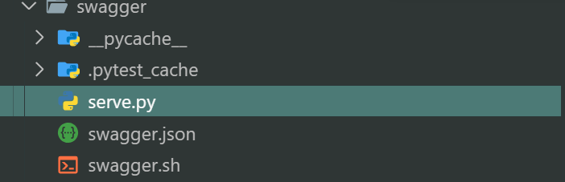
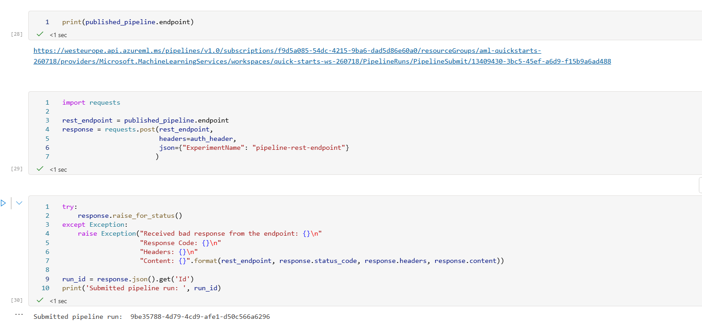

# Operationalizing AzureML
<p>This project is part of the Udacity Azure ML Nanodegree.</p>

The target of project is to help understand the pipeline process for releasing the model endpoint. Using AutoML to find the best model and create the AzureML Pipeline that can be reused and triggered by webhook. Once the ML endpoint is realeased, I will enable the application insight for the application to monitor and diagnostic the model endpoint. Using swagger-ui app to show documentation based on the swagger.json. Finally, we will consume the model endpoint to predict whether clients will subcribe to a bank term deposit.

## Architectural Diagram


## Improve the project in the future
Using the AzureML Pipeline Parallel to improve the AzureML pipeline

## Key Steps
### Create a new AutoML run
1. Already registered dataset, it appears in the  Data assets of AzureML portal.
    

1. Run the AutoML pipeline find the best models
    

1. The best model: Voting Ensemble
    
    
    

### Deploy a model and consume a model endpoint via an HTTP API
1. Deploy the model endpoint
    

1. Enable the application insights
    - Before:
    
    

    - After:
    
    

1. Consume the model endpoint by using endpoint.py
    
    

1. Documentation for model endpoint (using swagger)
    - Download the swagger.json and store in swagger folder
    
    - Run swaggerapi/swagger-ui container in docker
    
    - Run the server.py and expose the swagger using swaggerapi/swagger-ui
    
    

1. Apache Benchmark (ab) runs against the HTTP API using authentication keys to retrieve performance results.
    
    

### Publish an ML Pipeline
1. Create and publish a pipeline
    

1. Use a REST endpoint to interact with a Pipeline
    
    

1. Pipeline completed run
    
    The duration is has the short time (just 2s) because in AutoMLStep enable allow_reuse
    
    

## Screen Recording
https://youtu.be/1wiR52wcl4k?si=Yy20EGZuKRubUM1Y

## Standout Suggestions
Expose the ONNX best model:
``` py
from azureml.train.automl.run import AutoMLRun

for step in pipeline_run.get_steps():
    if step.properties.get("StepType") == "AutoMLStep":
        automl_run = AutoMLRun(experiment, step.id)
        break

best_run = automl_run.get_best_child()
best_run_metrics = best_run.get_metrics()
print("---------------------------------------------------------")
print(f'Run Id: {best_run.id}')
print(f'Accuracy: {best_run_metrics["accuracy"]}')
print("---------------------------------------------------------")
print("the onnx model is saved in the outputs directory")
os.makedirs("./outputs", exist_ok = True)
best_run.download_file("outputs/model.onnx", "./outputs/automl_model.onnx")

```
