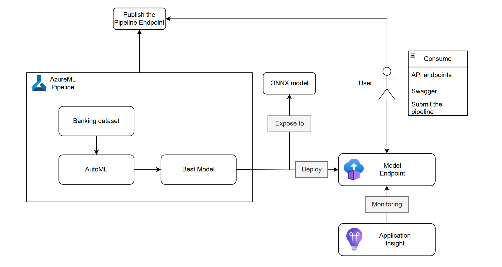
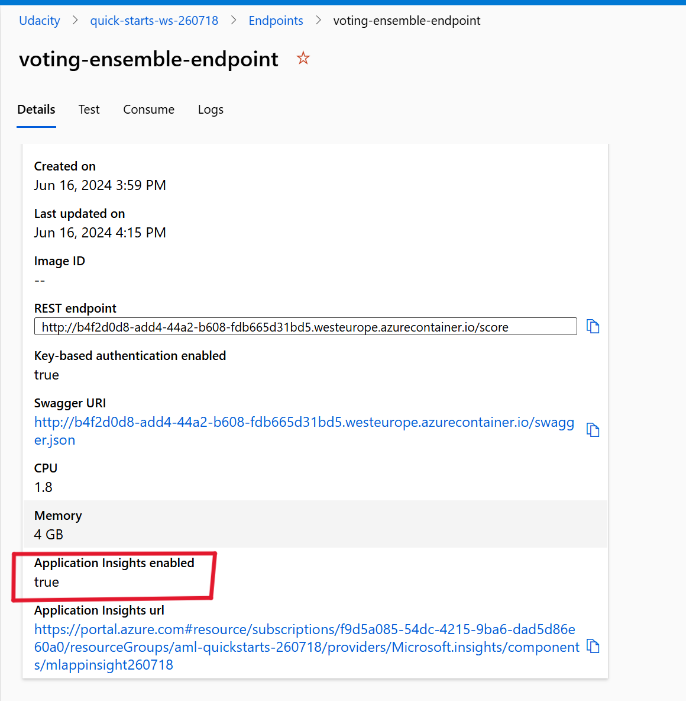

# Operationalizing AzureML
## Table of contents
- [Operationalizing AzureML](#operationalizing-azureml)
    - [Overview](#overview)
    - [Architectural Diagram](#architectural-diagram)
    - [Improve the project in the future](#improve-the-project-in-the-future)
    - [Key Steps](#key-steps)
        - [Create a new AutoML run](#create-a-new-automl-run)
        - [Deploy a model and consume a model endpoint via an HTTP API](#deploy-a-model-and-consume-a-model-endpoint-via-an-http-api)
        - [Publish an ML Pipeline](#publish-an-ml-pipeline)
    - [Screen Recording](#screen-recording)
    - [Standout Suggestions](#standout-suggestions)

## Overview
<p>This project is part of the Udacity Azure ML Nanodegree.</p>

The target of project is to help understand the pipeline process for releasing the model endpoint. The project is about the Bank marketing campain. I trained and identified the best model using the **AutoML** feature of **AzureML** service, utilizing the [Bank Marketing dataset](https://automlsamplenotebookdata.blob.core.windows.net/automl-sample-notebook-data/bankmarketing_train.csv) dataset, I deployed the model into the production using the Azure Container Instance (ACI) service and consumed it using the REST endpoint. I also created and published the AzureML Pipeline, which can be reused and triggered by a webhook. 

## Architectural Diagram

- Create the Pipeline: The pipeline is created by the python SDK. The pipeline stage include:
    - Get the Bank Marketing Dataset  
    - AutoML run
    - Identify the best model 
- Export the ONNX model: When the pipeline is finished, the best model is exported as an ONNX model.
- Deploy Model Endpoint: the Best Model is deployed using ACI, with Application Insight enabled to monitor the ACI
- Consume the model endpoint and read the Swagger: User can use the REST endpoint exposed by the Model Endpoint to predict the dataset. Swagger Documentation is available to help users understand how to use the REST endpoint.
- Publish the pipeline: The pipline is published using python SDK, allowing for future reuse.
- Consume the pipeline: User can submit the published pipline to run the training job again.

## Improve the project in the future
Using the AzureML Pipeline Parallel to improve the AzureML pipeline

## Key Steps
### Create a new AutoML run
#### Step 1: Register the Bank Maketing datatset
1. Already registered the Bank Maketing dataset, it appears in the Data assets of AzureML portal.
    

#### Step 2: Using the AutoML to find the best model.
1. Run the AutoML pipeline find the best model
    

1. The best model: Voting Ensemble algorithm
    

    Overview: the Voting Ensemble model achieved the highest acurray with a score of 0.91351
    
    
    Metric:
    

### Deploy a model and consume a model endpoint via an HTTP API
#### Step 1: Deploy the model endpoint
When we have the best model, using the best model to deploy the model endpoint service uing Azure Container Instance and we can access endpoint by REST API, and enable the authentication which make the service is secure.

The setting page for deploying the endpoint based on the model


#### Step 2: Enable the application insights
1. Before:
    The application insight is not enabled
    

    One the best model is deployed, I enable the application insight that monitoring the model endpoint.

    Enable application insight in logs.py file.
    

2. After

    The application insight is enabled in the Model Endpoint
    

    Using Application Insight to monitor and diagnostic the ACI (Azure Container Instance)
    

#### Step 3: Consume the model endpoint by using endpoint.py
1. Get the REST endpoint and primary key to use the POST method to call the endpoint to predict the client will subcribe to the bank term deposit.
    

1. Add the value obtained from the consume to the **scoring_url** and **key** variable, and run the endpoint.py to predict
    

#### Step 4: Documentation for model endpoint (using swagger)
1. Download the swagger.json and store in swagger folder


1. Run swaggerapi/swagger-ui container in docker


1. Run the server.py and expose the swagger using swaggerapi/swagger-ui


#### Step 5: **Apache Benchmark** (ab) runs against the HTTP API using authentication keys to retrieve performance results.

1. Run the ab cli to test performace the model endpoint
    

1. Result:
    

### Publish an ML Pipeline
1. Create and publish a pipeline
    

1. Use a REST endpoint to interact with a Pipeline
    
    The published pipeline overview page
    
    
    In the jupyter notebook, I consumed the publised pipeline endpoint to submit pipeline run.
    

1. Pipeline completed run
    
    The duration has the short time (just 2s) because in AutoMLStep enable allow_reuse
    
    

## Screen Recording
https://youtu.be/pUH3W8Ae5Vs

## Standout Suggestions
Export the ONNX best model:

The python script get the best model in the pipeline and download the onnx model in the best model is created by AutoML
``` py
from azureml.train.automl.run import AutoMLRun

for step in pipeline_run.get_steps():
    if step.properties.get("StepType") == "AutoMLStep":
        automl_run = AutoMLRun(experiment, step.id)
        break

best_run = automl_run.get_best_child()
best_run_metrics = best_run.get_metrics()
print("---------------------------------------------------------")
print(f'Run Id: {best_run.id}')
print(f'Accuracy: {best_run_metrics["accuracy"]}')
print("---------------------------------------------------------")
print("the onnx model is saved in the outputs directory")
os.makedirs("./outputs", exist_ok = True)
best_run.download_file("outputs/model.onnx", "./outputs/automl_model.onnx")

```
The onnx model is stored in outputs directory
